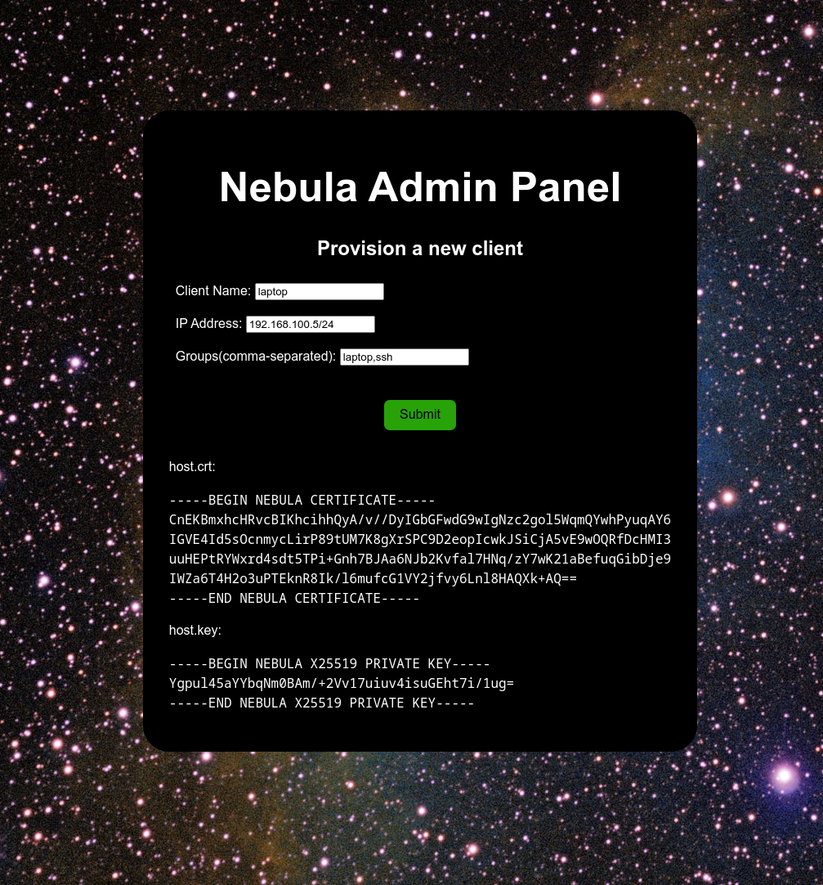

# nebula-admin-panel

A web gui for admins to provision new clients on the nebula network. Expected to be secured within nebula.

# Run from precompiled

See the Actions tab. Find a build from `main` and grab the zip. It will have a static binary and the `dist` folder with the frontend code.

I'm currently only building for Linux x86_64 statically.

# Run from source

## Dependencies

- `rust`
- `node`

## Why didn't you use Python, HTML, and maybe some Javascript?

I can write Typescript React without googling as much compared to vanilla Javascript.

I needed an excuse to write some Rust, and a small web server seemed like a good candidate. Unfortunately it makes it harder to deploy :-(

## Steps

- `cd gui`
- `yarn install`
- `yarn build`
- `cd ../backend`
- `cargo run --release`
- Check http://localhost:8000

# Firewall

Example rule for host running admin panel:

```
    # Allow admins to provision new users
    - port: 8000
      proto: tcp
      groups:
        - admins
```

# Screenshots



# Usage

```
nebula-admin-panel 0.1.0

USAGE:
    nebula-admin-panel [OPTIONS]

OPTIONS:
        --ca-crt <CA_CRT>    Path to the signing CA cert [default: ca.crt]
        --ca-key <CA_KEY>    Path to the signing CA cert [default: ca.key]
    -h, --help               Print help information
    -V, --version            Print version information
```
